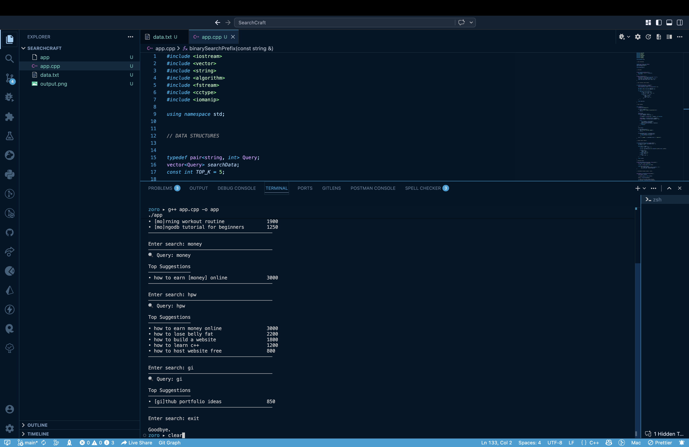

# 🔍 SearchCraft — Autocomplete Engine

## 📌 Case Study 2: Search Autocomplete Engine (Google Search)

### 🎯 Objective

Design and implement an efficient autocomplete system that returns the **top suggestions** for a given user query prefix in real time.

---

## 📊 Data Context

* Handles **large-scale datasets** (simulating millions of queries)
* Queries are **sorted lexicographically**
* Each query is associated with a **frequency score** (popularity)

---

## ⚙️ Approach

The system follows a **hybrid search strategy**:

### 1. Prefix Matching (Primary)

* Uses **Binary Search** to locate the starting point
* Performs **Linear Scan** to collect matching results
* Ensures fast lookup: `O(log n + k)`

### 2. Substring Matching (Fallback)

* If prefix match fails, searches within full query
* Improves usability for real-world queries

### 3. Fuzzy Matching (Advanced)

* Uses **Edit Distance Algorithm**
* Handles typos and approximate matches

### 4. Ranking

* Results are sorted by:

  * **Frequency (descending)**
  * **Lexicographical order (tie-breaker)**

---

## 📦 Deliverables

* Top **k ranked suggestions**
* Case-insensitive search handling
* Highlighted matching terms
* Clean and minimal terminal UI
* Performance tracking (time + space estimation)

---

## 📈 Outcome

* ⚡ Efficient hybrid search system
* 📊 Adapts dynamically based on query type
* 🚀 Scalable design for large datasets
* 🎯 Real-world behavior simulation (Google-like search)

---

# 💻 Project Overview

SearchCraft is a **C++-based autocomplete engine** that integrates multiple search techniques to deliver fast and intelligent suggestions.

---

## ✨ Features

* 🔍 Prefix search using Binary Search
* 🔁 Substring fallback search
* 🧠 Fuzzy matching (typo tolerance)
* 📊 Frequency-based ranking
* 🔡 Case-insensitive input handling
* 🎯 Highlighted matched text
* 🖥️ Clean terminal-based UI
* ⏱️ Performance reporting per query

---

## 📁 Project Structure

```
project/
│
├── app.cpp        # Main application code
├── data.txt       # Query dataset with frequency
├── output.png     # Sample output screenshot
```

---

## ⚙️ Build & Run

```bash
g++ -std=c++17 app.cpp -o app
./app
```

---

## ▶️ Usage

1. Run the executable
2. Enter a search query
3. View top suggestions instantly
4. Type `exit`, `quit`, or `q` to terminate

---

## 📊 Complexity Analysis

### 🔹 Prefix Match

* Time: `O(log n + k + k log k)`
* Space: `O(k)`

### 🔹 Substring Match

* Time: `O(n * m + k log k)`
* Space: `O(k)`

### 🔹 Fuzzy Match

* Time: `O(n * m² + k log k)`
* Space: `O(m² + k)`

---

### 📌 Where:

* `n` = number of queries
* `m` = length of input query
* `k` = number of suggestions (`TOP_K`)

---

## 📸 Sample Output



---

## 🧠 Key Learnings

* Hybrid algorithms improve both **performance and usability**
* Trade-offs between **speed (binary search)** and **flexibility (substring/fuzzy)**
* Importance of **real-time response systems**
* Practical exposure to **system design thinking**

---

## 🏁 Conclusion

SearchCraft demonstrates how combining **classical algorithms (binary search)** with **modern enhancements (fuzzy matching, ranking)** can create a system that is both **efficient and user-friendly**, closely resembling real-world search engines.

---
